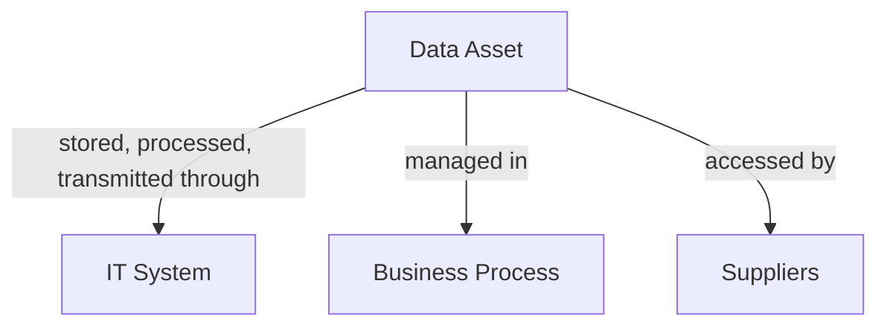

# **grc4ciso (GRC)**

## **Introduction**

This project provides you a GRC (Governance, Risk and Compliance) platform focused to manage Cybersecurity risks, control design and compliance.

With this platform, you can deploy ISO 27001:2022 as an Information Security Management System, perform cybersecurity risk analysis and evaluation, design and implement controls, and generate reports to demonstrate trust to your customers, stakeholders, and regulators—while ensuring compliance with cybersecurity requirements and regulations.

The platform has the following functionalities:

- Asset management.
- Risk Management.
- Control.
- ISMS: Information Security Management System (based on ISO27001:2022).
- Compliance.

## **Asset Management**

Assets that enable the organization to achieve business purposes are identified and managed consistent with their relative importance to organizational objectives and the organization’s risk strategy.

Understanding the organization’s assets (e.g., data, hardware, software, systems, facilities, services, people), suppliers, and related cybersecurity risks enables an organization to prioritize its efforts consistent with its risk management strategy and the mission needs.

### **Data Asset**

The primary catalog is the Data Asset Catalog, because ultimately, data is what we aim to protect. If data is exposed or compromised, it can have a significant negative impact on the organization. This module is designed to register the company’s critical data assets.

Some attributes captured here include: asset name, data classification, asset owner, RPO (Recovery Point Objective) and RTO (Recovery Time Objective) values, retention period, IT systems and processes where data is managed, and suppliers with access to that data.

Record your data assets in as much detail as possible. This information will allow us to accurately assess potential impacts on the organization and define the most appropriate risk management strategies for these assets.

### **IT System**

This is a high-level catalog of the organization’s critical platforms. It is not intended to be a CMDB (Configuration Management Database), but rather a registry of system platforms that support critical processes or store, transmit, or process critical data.
Some attributes captured here include: system name, description, IT components, IP addresses, URLs, ports, and responsible parties.

### **Business Process**

This is a high-level catalog of the processes where critical data is managed. Cybersecurity should be addressed not only from a technical systems perspective, but also by considering the processes in which data is handled, as well as the people and suppliers who have access to it.

### **Suppliers**

Suppliers (or third-party vendors) play a vital role in your organization’s operations, but they also introduce significant security and compliance risks. Many suppliers have access to your systems, sensitive data, or processing environments, which makes proper oversight essential.

To safeguard your organization, it is crucial to identify suppliers with access to critical data or systems. This enables you to perform a comprehensive vendor or supplier risk assessment as part of your overall risk management process. Effective supplier risk management helps mitigate potential threats, ensures regulatory compliance, and strengthens your organization’s data protection posture.

### **Reports**

Also you can generate reports and charts about TCP ports, IT components, data classification, business processes.

### **AI agent**

### **Notes and Tips**

> [!NOTE]
> **RTO (Recovery Time Objective)**
> 
> Definition: The maximum acceptable amount of time that a system, application, or process can be down after a disruption before significantly impacting the organization.
> 
> Focus: Time to restore services.
> 
> Application:
> 
> For IT systems: How long you can tolerate a system being offline (e.g., email server must be restored within 2 hours).
> 
> For business processes: Maximum downtime allowable before operations are severely impacted (e.g., order processing must resume within 4 hours).
> 
> For data assets: How long you can go without accessing critical data.

> [!NOTE]
> **RPO (Recovery Point Objective)**
>
> Definition: The maximum acceptable amount of data loss measured in time, i.e., how far back in time from the point of failure you can go and still recover data without serious consequences.
>
> Focus: Data loss tolerance.
>
> Application:
>
> For IT systems: How frequently data must be backed up (e.g., backups every 15 minutes for transactional databases)
>
> For business processes: How much data associated with a process can be lost (e.g., 30 minutes of unprocessed transactions).
>
> For data assets: Indicates the age of files or data that must be recoverable (e.g., no more than 1 hour of lost data).

## **Information Security Management System (ISMS)**

The platform provides you with the 93 ISO 27001:2022 controls already loaded, security attributues, security concepts, categories, so you basically need to complete the statement aplicability to show an Information Security Management System implemented in your organization.

Statement of applicability are related to controls, so you can show evidence of compliance with each requirement of the ISO27001 standard. This also ensures that the selected controls are aligned with the identified risks.
The status is calculated based on the controls that are related to each requirement, so you can link it with policies, procedures or evidences that demonstrate its implementation.

Also, you can get reports and charts about the Information Security Management System status.

## **Risk Management**

You can evaluate risks using CVSS (Common Vulnerability Score System) calculator integrated in the risk module.

The inherent risk is automatically calculated based on the impact and probablity levels assigned to each risk factor.

Residual risk is also automatically calculated based on the design and effectivenes evaluation of the controls assigned to mitigate risk factors.

### **Threat Scenario**

Identify and characterize threat sources of concern, including capability, intent, and targeting characteristics for adversarial threats and range of effects for non-adversarial threats. Organizations identify threat sources of concern and determine the characteristics associated with those threat sources. For adversarial threat sources, assess the capabilities, intentions, and targeting associated with the threat sources. For non-adversarial threat sources, assess the potential range of effects from the threat sources.

### **CVE Search**
This feature integrates with www.cve-search.org to retrieve CVE data for risk assessment. This feature helps organizations identify, evaluate, and manage vulnerabilities affecting their assets.

## **Control**

Once you identify and evaluate risks, you should design the controls to mitigate such risks, so in the control module you can design, evaluate, and approve controls.
Each control has a flow (draft, designed, implemented, approved), so the controls can be audited and evaluated to ensure they are effective to mitigate risks.

## **Compliance**

Stay compliant with cybersecurity frameworks. The platform also can be used to show compliance with legal, external or other compliance requirements like PCI, NIST, CIS Controls and OWASP.

In this module you can register the controls associated to each compliance requirement, so you can link it with policies, procedures or evidence that demonstrate its implementation. You can also get reports and charts about compliance status. 

## **Settings**

In this module basically you manage users, roles and privileges. 
If necessary, you can activate two factor authentication to users.

### **grc4ciso Roles**

R - Read, W - Write, C - Create, u - Unlink

|         | Asset Management | ISMS | Risk Management| Control | Compliance | Settings|
| --------|-------------|-------|------------|------------|------------|------------|
| GRC Admin | RWCU | RWCU | RWCU | RWCU | RWCU | RWCU |
| GRC Consultant |RWCU|RWCU|RWCU|RWCU|RWCU|RWCU|
| Asset Management|RWCU|R|R|R|R|R|
| ISMS |R|RWCU|R|R|R|R|
| Risk Management|R|R|RWCU|R|R|R|
| Control|R|R|R|RWCU|R|R|
| Compliance |R|R|R|R|RWCU|R|
| Guest|R|R|R|R|R|R|

## **Other Functionalities**

Since this project is built on the Odoo platform, you can leverage its native functionalities to streamline your processes.

Tracking Changes: Every modification to a record is automatically logged, giving you full visibility and an audit trail of all changes.

You can send notifications to other users to inform about updates, requirements, collaboration or other information you want to communicate.

## **Docker Installation**

1. Install docker.
2. Create docker instances, grc4ciso works with Odoo 16.
   
`docker run -d --net [YOUR_NETWORK] --restart=always -p 5432:5432 --shm-size=256m -e POSTGRES_USER=odoo -e POSTGRES_PASSWORD=[POSTGRES_PASSWORD] -e POSTGRES_DB=postgres --name [INSTANCE_NAME] postgres:latest`

`docker run -d --net [YOUR_NETWORK] --restart=always -p 8069:8069 -p 8072:8072 --name [INSTANCE_NAME] --link [DB_INSTANCE_NAME]:db -e PASSWORD=[PSTGRES_PASSWORD] -t odoo:16.0-20250207`

3. Update and Install packages into the odoo docker instance

`docker exec -it -u 0 odoo_grc_test apt update`

`docker exec -it -u 0 odoo_grc_test apt install git`

`docker exec -it odoo_grc_test pip3 install cvss==2.6 xw_utils==1.1.12 json5==0.9.14 openai markdown markdown2 json2table`

4. Configure Odoo https://[YOU_HOST]:8069

5. Into your Odoo instance, clone the project in /mnt/extra-addons
   
`git clone https://github.com/OWASP/www-project-it-grc`
   
6. In /etc/odoo/odoo.conf add the addons-path www-project-it-grc

7. Restart your docker odoo instance `docker restart [INSTANCE_NAME]`

8. With "developer mode" execute "Apps" --> "Update Apps List".

9. Install the grcbit_ modules in the following order: 1. grcbit_base, grcbit_iso27001, grcbit_compliance, grcbit_threat_scenario, grcbit_pci4, grcbit_cvss, grcbit_vulnerability_management  

## **Import data**

To import data to your database, you can use "Favorites" --> "Import records" option.  

Data repository: https://github.com/grcbit/grc4ciso-data-1 

## **Demo**

- https://democommunity.grc4ciso.com/
- guest / guest123

## **Contact**

- email: rodolfo.lopez@outlook.com
