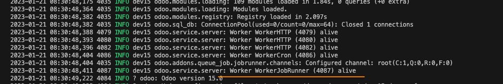
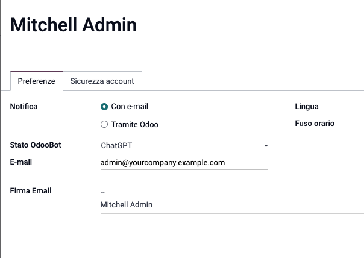
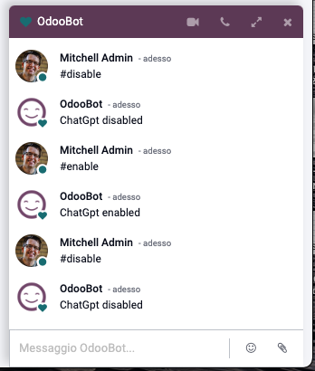
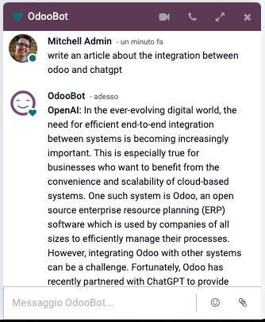
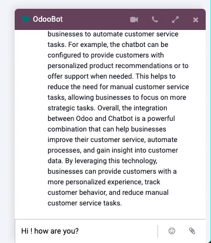

OpenAI ChatGPT Odoo Module
===========================

.. |badge2| image:: https://img.shields.io/badge/licence-AGPL--3-blue.png
    :target: http://www.gnu.org/licenses/agpl-3.0-standalone.html
    :alt: License: AGPL-3

|badge2|  

This Odoo module allows for seamless integration with the OpenAI ChatGPT API, 
				providing advanced natural language processing capabilities within the Odoo platform. 
				With this module, users can leverage the power of ChatGPT to generate human-like text, 
				perform language translation, and more. 
				It utilizes API calls to communicate with the OpenAI service, 
				making it easy to set up and use.

``You can answer: how many company in the system? how many contacts in a system? whats is today?``
> **Add gpt-3.5-turbo model**

**Table of contents**

**video**
* https://www.youtube.com/watch?v=8eiaRQZu4II

Configuration
=============

* Go to 'Settings / chatGPT bot and set an API key'.
* you can retrive an api Key from https://beta.openai.com/ and create a new key here: https://beta.openai.com/account/api-keys
* This module require the offical library openai
* you install with ``pip install openai``
* Now you can use the chatGPT bot in the chat window.
* you can set the default bot in the file ``mail_bot.py``
  

Bugfix and new features
=======================
05/03/2023
* add historic conversation for new model and correct order for message
03/03/2023
* add support for gpt-3.5-turbo model

24/02/2023
* bugfix error in coversation review the last response

15/12/2023
* add support latest conversartion and some data in mail_bot.py

Usage
=====

To use this module, you need to:

* require queque_job from `queue_job <https://github.com/OCA/queue/tree/15.0/queue_job>`_.
* After the installation to this module, you must change the configuration and add this on the configuration file:
* ``server_wide_modules = base,web,queue_job`` add ``queue_job``
* Then restart the server and see a logs file in server console.

**History Context**

- Now you can use the chatGPT with latest conversation and maintain the context of the conversation.
- default pass a 10 latest conversation and some data in the context.
- The conversation is natural and contextual.
- ``You can answer: how many company in the system? how many contacts in a system? whats is today?``

**Added support for same user language**
- you can set the language in the user preferences.

**This module is required for not blocking the server when the API is called.**

Configuration users
===================

inside the preferences of the user you can set the chatGPT bot as default bot.

**You can activate or deactivate the chatGPT bot for each user.**
**You can activate or deactivate the chatGPT directly in the chat window.** 

You can type: ``#enable`` or ``#disable``

Example
=======

Bug Tracker
===========

Bugs are tracked on `GitHub Issues <https://github.com/crottolo/free_addons/issues>`_.
In case of trouble, please check there if your issue has already been reported.
If you spotted it first, help us smashing it by providing a detailed and welcomed

Do not contact contributors directly about support or help with technical issues.

Credits
=======

Authors
~~~~~~~

* FL1 sro

Contributors
~~~~~~~~~~~~

* Roberto Crotti <bo@fl1.cz>

Maintainers
~~~~~~~~~~~

This module is maintained by the FL1.

.. image:: https://fl1.cz/web/image/1156-2d6fce00/FL1%20logo%20def.png
   :alt: Odoo Fl1 sro
   :target: https://fl1.cz
   :width: 50 px

